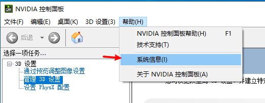
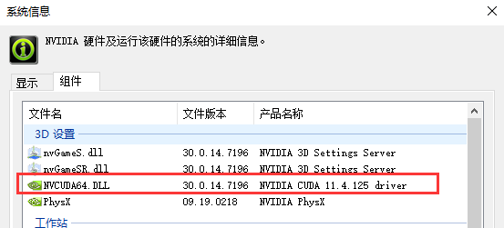
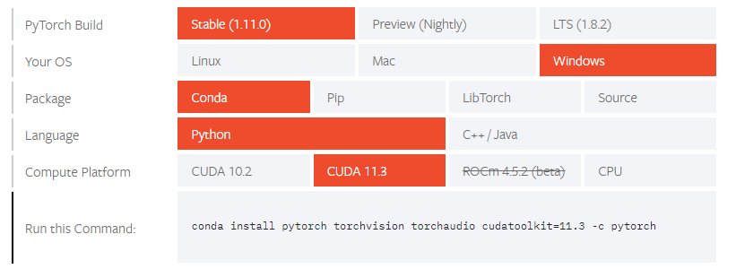
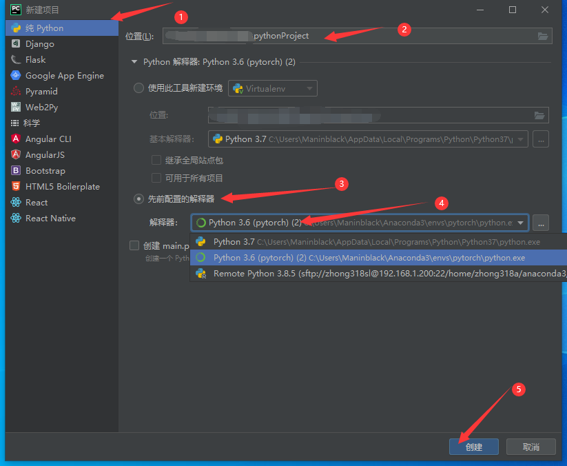

# SNN中文教程

本教程旨在从零开始，指导读者使用 python 语言的 pytorch 和 spikingjelly 框架搭建脉冲神经网络（SNN）模型，来实现在 MNIST 数据集上的分类任务。

## 前期环境搭建

### 1. 安装 Anaconda / miniconda

1. Anaconda 介绍

Anaconda 指的是一个开源的 Python 发行版本，其包含了 conda、Python 等180多个科学包及其依赖项。 因为包含了大量的科学包，Anaconda 的下载文件比较大（约 531 MB），如果只需要某些包，或者需要节省带宽或存储空间，也可以使用 Miniconda 这个较小的发行版（仅包含 conda 和 Python ）。

2. **Anaconda下载**

Anaconda 官网下载地址：https://www.anaconda.com/download/

清华镜像下载地址：https://mirrors.tuna.tsinghua.edu.cn/anaconda/archive/

根据系统下载合适的版本，例如：Anaconda3-5.3.1-Windows-x86_64.exe。

3. **Anaconda 安装**

- Windows 下是一个 exe 文件，选好安装路径，一路 next 即可。
- 进入环境变量设置界面，选择系统变量下的 Path 变量，把安装目录及目录下的 Scripts 添加到 Path 变量中。
- 进入 cmd ，输入conda –V 及 python –V，能正确输出版本名称即为安装成功，例如：conda 5.3.1, python 3.7.3。


### 2. 创建环境

环境管理则允许用户方便地安装不同版本的 python 和其他包并可以快速切换。

打开安装完 Anaconda 后出现的 Anaconda Prompt，然后按顺序输入以下命令。

- **创建环境命令：conda create –n env_name python=3.7**

其中 env_name 可以替换成你自己起的环境名字，python=3.7 为指定环境中的 python 版本， 例如：conda create –n pytorch python=3.7

- **激活环境命令：activate env_name**

env_name 同上

- **退出环境命令：conda deactivate**


### 3. 安装pytorch

1. 添加镜像源

在安装 pytorch 之前，可以先给 Anaconda 添加 pytorch 镜像源，这样下载 pytorch 时会更快，如果有梯子，可以忽略。

在 C:\User\username\ 下找到 .condarc 文件，如果没有可以新建一个，用记事本打开即可。

然后在其中添加以下内容，然后保存即可。

```
channels:
  - https://mirrors.tuna.tsinghua.edu.cn/anaconda/pkgs/main/
  - https://mirrors.tuna.tsinghua.edu.cn/anaconda/pkgs/free/
  - https://mirrors.tuna.tsinghua.edu.cn/anaconda/cloud/conda-forge/
  - https://mirrors.tuna.tsinghua.edu.cn/anaconda/pkgs/free/
  - https://mirrors.tuna.tsinghua.edu.cn/anaconda/pkgs/main/
  - https://mirrors.tuna.tsinghua.edu.cn/anaconda/cloud/conda-forge/
  - https://mirrors.tuna.tsinghua.edu.cn/anaconda/cloud/msys2/
  - https://mirrors.tuna.tsinghua.edu.cn/anaconda/cloud/bioconda/
  - https://mirrors.tuna.tsinghua.edu.cn/anaconda/cloud/menpo/
  - https://mirrors.tuna.tsinghua.edu.cn/anaconda/cloud/pytorch/
show_channel_urls: true
```

2. **查看电脑 CUDA 版本**

如果想用使用 gpu 加速神经网络训练，肯定需要使用 gpu 版本的 pytoch ，那么知道你电脑的 CUDA 版本

- 打开 NVIDIA 控制面板，帮助中找到系统信息





这里可以看到我的电脑 CUDA 版本是 11.4，那么 11.4 以下的版本都可以安装。

3. **下载pytorch**

- pytorch下载地址：https://pytorch.org/

- 点击 Install ，然后选择 Stable 稳定版，Windows 版本，conda 安装， python 语言， CUDA 版本选择的是 11.3。



- 然后复制 Run this Command 的命令
- 打开 Anaconda Prompt，使用 `conda activate pytorch` 激活新建的 pytorch 环境，然后粘贴刚刚的命令，~~但是删掉最后的 `-c pytorch`~~。执行`conda install pytorch torchvision torchaudio cudatoolkit=11.3` 即可。

- 完成安装后，进行测试。进入 pytorch 环境后， 输入 python 回车，进入python。然后输入 `import torch` ，不报错说明安装成功。然后看看 CUDA 是否安装成功，输入 `torch.cuda.is_available()`， 返回 True 则大功告成。


### 4. 安装 spikingjelly

[SpikingJelly](https://github.com/fangwei123456/spikingjelly) 是一个基于 [PyTorch](https://pytorch.org/) ，使用脉冲神经网络 (Spiking Neural Network, SNN) 进行深度学习的框架。

Spikingjelly 的安装地址：https://github.com/fangwei123456/spikingjelly

稳定版本安装方法：

- 激活要安装的环境，例如：`conda activate pytorch`
- 输入：`pip install spikingjelly`


### 5. Python 集成开发环境

- **Pycharm 简介及下载**

Python 可用的集成开发环境（IDE）有很多，例如 Pycharm，VScode，Jupyter notebook，Spyder等等。这里推荐使用 Pycharm，因为对于新手而言，Pycharm 有很多足够智能的帮助（调试、语法高亮、环境管理）。

Pycharm 在官网上有免费版可以下载。下载地址：https://www.jetbrains.com/pycharm/download/#section=windows，选择社区版即可。

打开安装包后，一路 next 即可。

- **新建项目及 conda 环境配置**

安装好 Pycharm 后，打开 Pycharm ，新建纯 Python 项目，选择好项目地址后，下面的 Python 解释器选择先前配置的解释器，然后找到之前新建的 conda 环境中的 python.exe 的位置，路径一般是：`C:\Users\username\Anaconda3\envs\pytorch\python.exe`，其中 username 是用户名。然后点击创建即可新建 python项目。




## 网络模型训练

### 1. 导入需要用到的包

```python
import torch
import torch.nn as nn
import torch.nn.functional as F
import torch.optim as optim
from torchvision import datasets, transforms
from torch.utils.data import DataLoader
from spikingjelly.clock_driven import neuron, surrogate, functional
from torch.utils.tensorboard import SummaryWriter
```


### 2. 设置超参数

```python
BATCH_SIZE = 512		# 每批处理数据的数量
EPOCHS = 10				# 数据集训练的轮次
LEARNING_RATE = 10e-3   # 学习率
DEVICE = torch.device('cuda:0' if torch.cuda.is_available() else 'cpu')		# 使用gpu还是cpu
```


### 3. 下载数据集

在 Python 项目中，新建 train.py 文件。使用torchvision.datasets，其中含有一些常见的 MNIST 等数据集，使用方法如下：

```python
train_dataset = datasets.MNIST(
    root='data',		# 表示下载位置
    train=True,			# True下载就会是训练集，False下载就会是测试集
    transform=transforms.Compose([
        transforms.ToTensor(),
        transforms.Normalize((0.1307,), (0.3081, ))
    ]),
    download=True
)
test_dataset = datasets.MNIST(
    root='data',
    train=False,
    transform=transforms.Compose([
        transforms.ToTensor(),
        transforms.Normalize((0.1307,), (0.3081,))
    ]),
    download=True
)

train_dataloader = DataLoader(train_dataset, batch_size=BATCH_SIZE, shuffle=True)
test_dataloader = DataLoader(test_dataset, batch_size=BATCH_SIZE, shuffle=True)
```


### 4. 搭建脉冲神经网络模型

```python
class SNN(nn.Module):
    def __init__(self, tau, T, v_threshold=1.0, v_reset=0.0):
        super().__init__()
        self.T = T

        self.conv = nn.Sequential(
            nn.Conv2d(1, 10, kernel_size=3, padding=1, bias=False),
            neuron.IFNode(v_threshold=v_threshold, v_reset=v_reset, surrogate_function=surrogate.ATan()),
            nn.MaxPool2d(2, 2),

            nn.Conv2d(10, 20, kernel_size=3, padding=1, bias=False),
            neuron.IFNode(v_threshold=v_threshold, v_reset=v_reset, surrogate_function=surrogate.ATan()),
            nn.MaxPool2d(2, 2),
        )

        self.fc = nn.Sequential(
            nn.Flatten(),
            nn.Linear(20 * 7 * 7, 100, bias=False),
            neuron.LIFNode(tau=tau, v_threshold=v_threshold, v_reset=v_reset, surrogate_function=surrogate.ATan()),
            nn.Linear(100, 10, bias=False),
            neuron.LIFNode(tau=tau, v_threshold=v_threshold, v_reset=v_reset, surrogate_function=surrogate.ATan()),
        )

    def forward(self, x):
        x = self.conv(x)
        out_spike_counter = self.fc(x)
        for t in range(1, self.T):
            out_spike_counter += self.fc(x)
        return F.log_softmax(out_spike_counter / self.T)
```


### 5. 训练及测试函数

**训练函数**

```python
def train(model, device, train_loader, optimizer, log, epoch, writer):
    model.train()

    for index, (img, label) in enumerate(train_loader):
        img, label = img.to(device), label.to(device)
        label_one_hot = F.one_hot(label, 10).float()

        optimizer.zero_grad()
        output = model(img)
        loss = F.mse_loss(output, label_one_hot)
        loss.backward()
        optimizer.step()

        functional.reset_net(model)

        writer.add_scalar('train loss', loss, index + epoch * len(train_loader))
        print('Train : [{}/{} ({:.0f}%)]\tLoss: {:.6f}\tepoch:{}'.format(
            index * len(img), len(train_loader.dataset),
            100. * index / len(train_loader), loss.item(), epoch))
        log.append(f"Train loss: {loss.item():.6f}\n")
```

**测试函数**

```python
def test(model, device, test_loader, log, epoch, writer):
    model.eval()
    test_loss = 0
    correct = 0
    for index, (img, label) in enumerate(test_loader):
        img, label = img.to(device), label.to(device)
        label_one_hot = F.one_hot(label, 10).float()

        output = model(img)
        functional.reset_net(model)

        test_loss += F.mse_loss(output, label_one_hot)
        pred = output.max(1, keepdim=True)[1]       # 找到概率最大的下标
        correct += pred.eq(label.view_as(pred)).sum().item()

    test_loss /= len(test_loader)
    writer.add_scalar('test loss', test_loss, epoch)
    print('Test set: Average loss: {:.4f}, Accuracy: {}/{} ({:.0f}%) epoch:{}\n'.format(
        test_loss, correct, len(test_loader.dataset),
        100. * correct / len(test_loader.dataset), epoch))
    log.append(f"Test set: Average loss: {test_loss:.4f}, \
                Accuracy: {correct}/{len(test_loader.dataset)} \
                ({100. * correct / len(test_loader.dataset):.0f}%) epoch:{epoch}\n")
```

**主函数**

```python
if __name__ == '__main__':
    model = SNN(tau=2.0, T=8).to(DEVICE)
    optimizer = optim.Adam(model.parameters(), lr=LEARNING_RATE)
    log = []
    writer = SummaryWriter()

    for epoch in range(EPOCHS):
        log.append(f"Train epoch: {epoch} / {EPOCHS}\n")
        train(model, DEVICE, train_dataloader, optimizer, log, epoch, writer)
        test(model, DEVICE, test_dataloader, log, epoch, writer)

    # save model
    torch.save(model, './MNIST.pth')
    writer.close()

    with open('./SNN_train.txt', 'w+') as f:
        for i in range(len(log)):
            f.write(log[i])
```

实验结果保存在同一文件目录下 SNN_train.txt 文件中。

训练结果最后可以达到测试集98%准确度。

**完整教程代码**：[Maninnlack/SNN_Tutorial (github.com)](https://github.com/Maninnlack/SNN_Tutorial)


